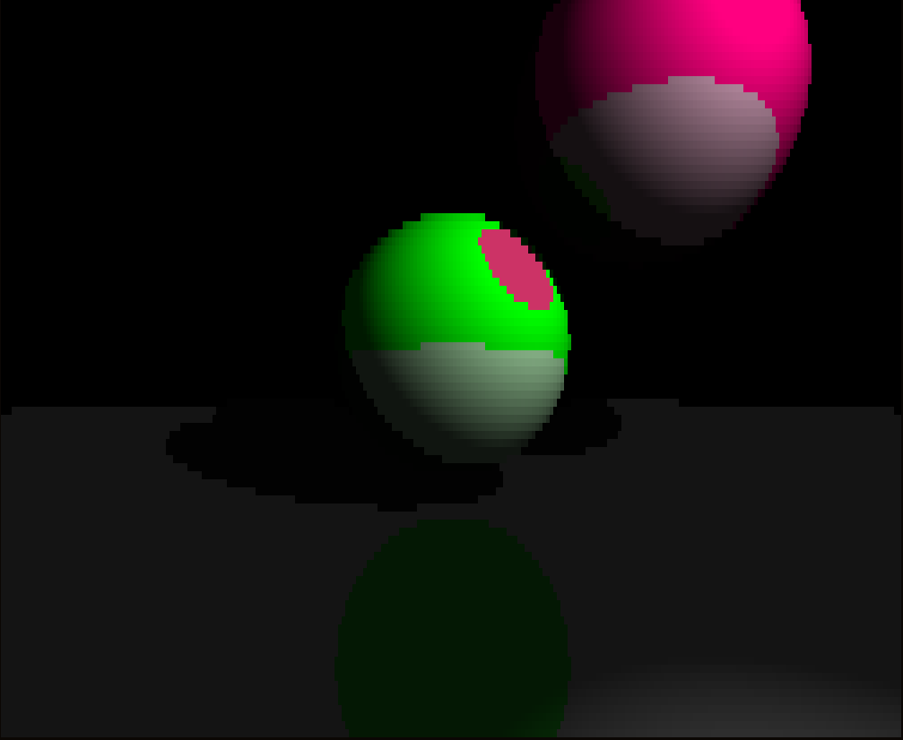

# Simple and dumb ray tracer



## Run
```bash
$ cargo run
```

## Usage

- `p` - pause/resume animations
- `q` / `ESC` - quit

## TODO
- [x] Runs in terminal
- [ ] Runs in GUI
- [ ] Saves image to file
- [ ] Multithreading
- [ ] Monte-Carlo sampling
- [ ] Loads scene from file
